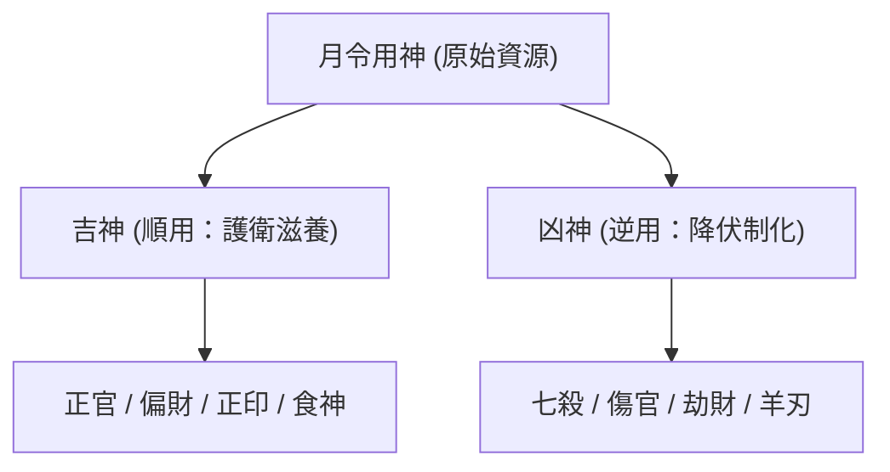

import { Image } from 'astro:assets';
import heroImage from '../../../../../assets/chapters/bazi/zi-ping-zhen-quan/main.webp';

  <Image src={heroImage} alt="子平真詮 第五章" class="hero-image" />
  

# 第五章・月令用神與成敗救應

> 「八字用神，專求月令。成中有敗，必是帶忌；敗中有成，全憑救應。」—— 沈孝瞻

---

## 📖 經典原文

### 一、論用神（順用與逆用）
八字用神，專求月令，以日干配月令地支，而生克不同，格局分焉。

*   **順用之吉神**：財官印食，此用神之善而順用之者也。
    *   **財**宜生扶，喜食神以相生，生官以護財。
    *   **官**宜寬舒，喜財印以相隨，忌刑沖破害。
    *   **印**宜資助，喜官煞以相生，忌財星之破。
    *   **食**宜洩身之秀，喜生財，忌梟神奪食。
*   **逆用之凶神**：煞傷劫刃，用神之不善而逆用之者也。
    *   **煞**宜制伏，喜食神以制煞，忌財印資扶。
    *   **傷**宜配印，或生財以化傷。
    *   **刃**宜官煞制伏，忌無官煞。
    *   **劫**宜透官以制劫，或透食傷以化劫。

當順而順，當逆而逆，配合得宜，皆為貴格。

### 二、何謂成格？何謂破格？

#### ① 格局之成
*   **正官格**：官逢財印，無刑沖破害。
*   **財格**：財旺生官；或財逢食生，身強帶比；或財格透印，但財印位置妥帖，不相障礙。
*   **印格**：印輕逢煞；或官印雙全；或身印兩旺而用食傷洩氣；或印多逢財，而財透根輕。
*   **食神格**：食神生財；或食神帶煞而無財；或棄食就煞而透印。
*   **七煞格**：身強七煞逢食神制伏。
*   **傷官格**：傷官生財；或傷官佩印，而傷官旺、印有根；或傷官旺、身主弱而透煞印；或傷官帶煞而無財。
*   **陽刃格**：透官煞而露財印，不見傷官。
*   **建祿月劫格**：透官而逢財印；或透財而逢食傷；或透煞而遇制伏。

#### ② 格局之敗
*   **正官格**：逢傷官剋害，或逢刑沖。
*   **財格**：財輕比劫重，無食傷化劫；或財透七煞。
*   **印格**：印輕逢財剋；或身強印重而透煞。
*   **食神格**：逢梟神奪食；或食神生財卻又露出七煞。
*   **七煞格**：逢財星資煞而無制。
*   **傷官格**：非金水傷官而見官星（傷官見官）；或傷官生財卻帶七煞；或佩印而傷官輕、身主旺。
*   **陽刃格**：無官煞制伏。
*   **建祿月劫格**：無財官可用，反而透出煞印。

### 三、論用神成敗救應（相神的作用）
八字妙用，全在成敗救應，其中權輕權重，甚是活潑。學者從此留心，能於萬變中融以一理，則於命之一道，其庶幾乎！

**何謂救應？**
*   **官逢傷**而透印以解之；**雜煞**而合煞以清之；**刑衝**而會合以解之。
*   **財逢劫**而透食以化之，生官以制之；**逢煞**而食神制煞以生財，或存財而合煞。
*   **印逢財**而劫財以解之，或合財而存印。
*   **食逢梟**而就煞以成格，或生財以護食。
*   **煞逢食制，印來護煞**，而逢財以去印存食。
*   **傷官生財透煞**而煞逢合。
*   **陽刃用官煞帶傷食**，而重印以護之。
*   **建祿月劫用官**，遇傷而傷被合；**用財帶煞**而煞被合。
是謂之救應也。

---

## 💡 深度白話解析

### 1. 什麼是格局派的「用神」？
現代命理常用「日主強弱」來選取用神（身弱用印比，身強用食傷官殺）。然而，**正宗子平格局派的「用神」，專指「月令提綱」**。
*   月令是命局四時之氣的總司令。
*   「用神」就像是人出生時所帶有的**社會原始資源與出發點**。
*   論命不是先看日主強弱，而是先看月令這股資源（用神），如何與其他天干地支發生生剋關係，進而形成不同的「格局」。

### 2. 格局的「順用」與「逆用」
沈氏提出了對待資源的兩種根本態度，這與佛家「順應」與「降伏」的智慧相通：

*   **吉神宜順用**：
    正官、偏正財、正偏印、食神是溫和、建設性的能量。對待它們，要像呵護溫室裡的花朵一樣去「生它、護它」。比如正官格，宜用財生官，用印護官防傷官。
*   **凶神宜逆用**：
    七殺、傷官、羊刃、劫財是狂暴、破壞性的能量。對待它們，必須像馴服野馬一樣去「克制它、轉化它」。比如七殺格，必須用食神去制伏，或者用印星去化解七殺之暴烈。

---

## 📊 八字格局成敗對照表

這是沈氏留給後世最清晰的格局判斷工具，請熟記：

| 格局名稱 | 🟢 成格條件（貴徵） | 🔴 破格條件（貧賤或多災） |
| :--- | :--- | :--- |
| **正官格** | 官星得財生、印護，無刑沖破害。 | 逢傷官剋官（傷官見官），或被沖刑。 |
| **財格** | 財旺生官；身旺比劫重有食傷洩秀生財。 | 財輕比劫重且無食傷化劫；財格透七殺。 |
| **印格** | 官印相生；身印兩旺有食傷洩秀。 | 印輕逢財剋（貪財壞印）；身強印重透七殺。 |
| **食神格** | 食神生財；身強食神制殺且無財。 | 逢梟神（偏印）奪食；食神生財卻又露七殺。 |
| **七煞格** | 身強七殺逢食神制伏（食神制殺）。 | 逢財星生助七殺且無制（財資弱殺）。 |
| **傷官格** | 傷官生財；傷官佩印（身弱印有根）。 | 非金水傷官見官；傷官生財卻帶七殺。 |
| **陽刃格** | 逢七殺或正官制伏，有財印相隨。 | 全無官殺制刃，或官殺被傷官破壞。 |
| **建祿月劫** | 透官有財印護衛；透財有食傷洩秀。 | 無財官可用，反而透出煞印混雜。 |

---

### 3. 「救應」——命局的自我修復系統
天無絕人之路。如果八字格局被破（敗），但如果四柱中恰好有一個「救星」（相神）挺身而出，將破格的忌神制伏或合走，這就叫**「救應」**，命局將**「敗中有成」**，反而能歷經坎坷後獲得更大的成功。

*   **案例一：正官格逢傷官（破格） ➡️ 透印救應**
    正官被傷官剋害，正官受傷。此時如果天干透出「正印（庚/辛）」，印星直接去剋制傷官，傷官被制服，無法再傷害正官，這就是**「官逢傷而透印解之」**。
*   **案例二：財逢劫奪（破格） ➡️ 透食傷救應**
    財星被滿盤比劫爭奪，財富散盡。如果此時天干透出「食神」，比劫原本要去搶財，但遇到食神，它們的能量被食神「洩掉」，食神轉而將這股能量生助財星，這就是**「財逢劫而透食化之」**。
*   **案例三：食神逢梟（破格） ➡️ 就煞以成格**
    食神本來怕梟神（偏印）奪食。但此時如果八字中有「七殺」，梟神見了七殺，就會去化七殺的力量，食神得以保全，這就是**「食逢梟而就煞以成格」**。
