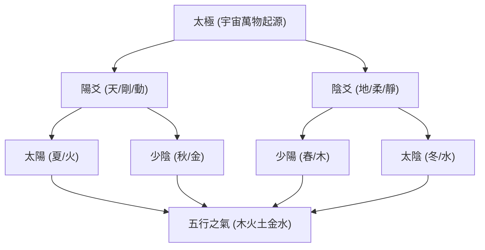

import { Image } from 'astro:assets';
import heroImage from '../../../../assets/chapters/bazi/zi-ping-zhen-quan/main.webp';

  <Image src={heroImage} alt="子平真詮 總綱" class="hero-image" />
  

# 子平真詮：八字格局之法門

如果說《滴天髓》是探討五行氣息中和的「理氣聖經」，那麼清代沈孝瞻所著的**《子平真詮》**就是判定人生命運社會屬性與富貴層次的「格局大法」。

本書以**「月令用神」**為宗，將紛繁複雜的八字命局條分縷析，歸納出系統性的「成敗救應」與「取運規則」。它是八字命理學從「無序神煞」走向「嚴密邏輯」的里程碑之作。

---

## 🔮 命理之前：易學的宇宙底層邏輯

在正式深入《子平真詮》的格局殿堂前，我們必須先理解易學的底層密碼。人的命運（命理）是宇宙自然規律的一部分，其演變遵循著太極、陰陽與五行的流轉：

### 1. 陰陽的對立與和諧
世間萬物皆有既對立又統一的兩面，既互相排斥又互相依存。寒來暑往，黑夜與白天交替，**陰極生陽，陽極生陰**。這與西方的辯證法相似，但不同的是：
*   **西方辯證法**：強調矛盾鬥爭中產生的發展與新事物。
*   **東方陰陽論**：追求的是**天人合一、動靜平衡的和諧共生**。

### 2. 四象與時間的脈動
陰陽的消長形成了「太陽、太陰、少陽、少陰」四象，具體體現在自然界的四季與人生的起伏中：
*   **春季（少陽）**：萬物復甦，為**木氣**。如同人生的年幼時期，生機蓬勃，向上發展。
*   **夏季（太陽）**：烈日當頭，為**火氣**。如同人生的青年時期，朝氣蓬勃，陽氣最盛。
*   **秋季（少陰）**：秋收葉落，為**金氣**。如同人生的中年時期，蕭瑟內斂，由強轉弱。
*   **冬季（太陰）**：大地冰寒，為**水氣**。如同人生的晚年時期，萬物沉潛，走向歸宿。

### 3. 五行：是「氣」的流動，而非「實物」
很多人誤以為五行指的是木頭、鐵器、泥土等具體物質。實際上，**五行是「氣的流動與狀態」**：
*   **木**：不只是木頭，而是大樹向上生長、四散生發的**生發之氣**。
*   **金**：不只是刀劍，而是秋風掃落葉、收斂與肅殺的**肅殺之氣**。
*   **土**：代表大地和生態，承載著木火金水之氣的輪轉，**旺於四季交換之時**，是萬物的起點與終點。

---

## 為什麼要學《子平真詮》？

1. **破除神煞，以理推命**：沈氏反對死記硬背神煞，主張回歸干支五行的生剋制化與月令格局。
2. **極致的邏輯體系**：首次提出「用神成敗救應」與「相神」概念，使论命過程像解數學題一般嚴謹、可複製。
3. **官財印食的富貴層次**：對於社會關係（名利、官職、财富、家庭）的推導極為精準，是現代人理解社會定位的絕佳工具。

---

## 學習地圖

本站依據《子平真詮》的理論脈絡，將 48 章原著重構為以下三大核心板塊：

### 一、 🌿 基礎理論 (01-foundation)
從十干十二支的來源、陰陽生死的動靜、十干的配合與合化，到刑沖會合的解法。在此板塊，我們將打通天干與地支的交互管道，奠定最紮實的命理根基。

### 二、 🎯 用神格局 (02-yongshen)
深入探討《子平真詮》最精妙的靈魂——**「用神」**。理解用神如何從月令中取得，如何因成得敗、因敗得成，以及「相神」在格局成敗中起到的無形推手作用。

### 三、 👑 格局取法與運勢 (03-patterns)
將「正官、七殺、財、印、食神、傷官、祿刃、雜格」八大格局的定義、成格條件與「取運喜忌」進行全景透視，讓您在面對真實命盤時，能一眼看穿運勢的吉凶起伏。

---

> 「八字用神，專求月令。以日干配月令地支，而生剋不同，格局分焉。」—— 讓我們跟隨沈孝瞻大師的步伐，開啟這場理性與玄妙交織的格局之旅。
